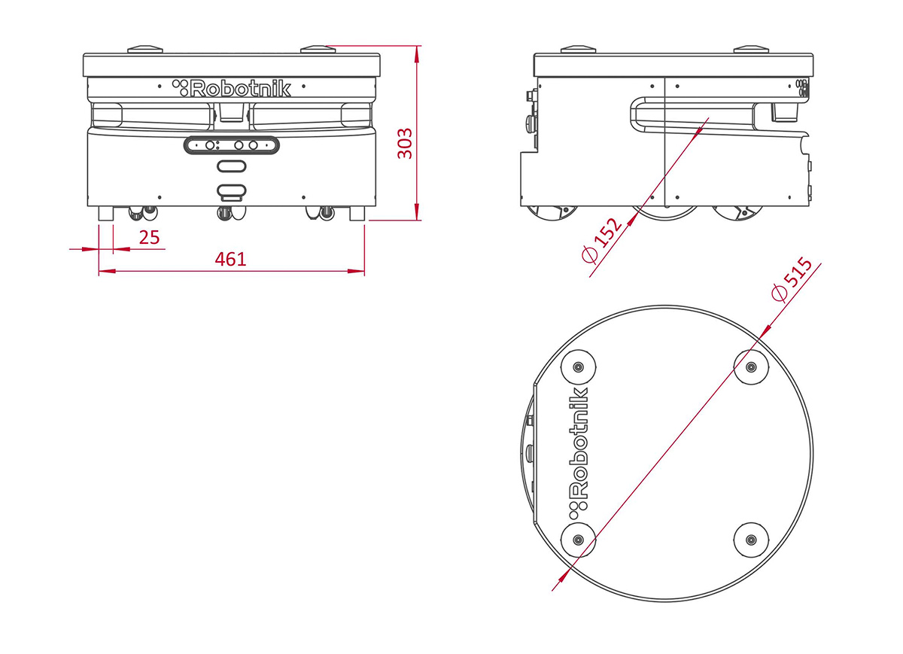
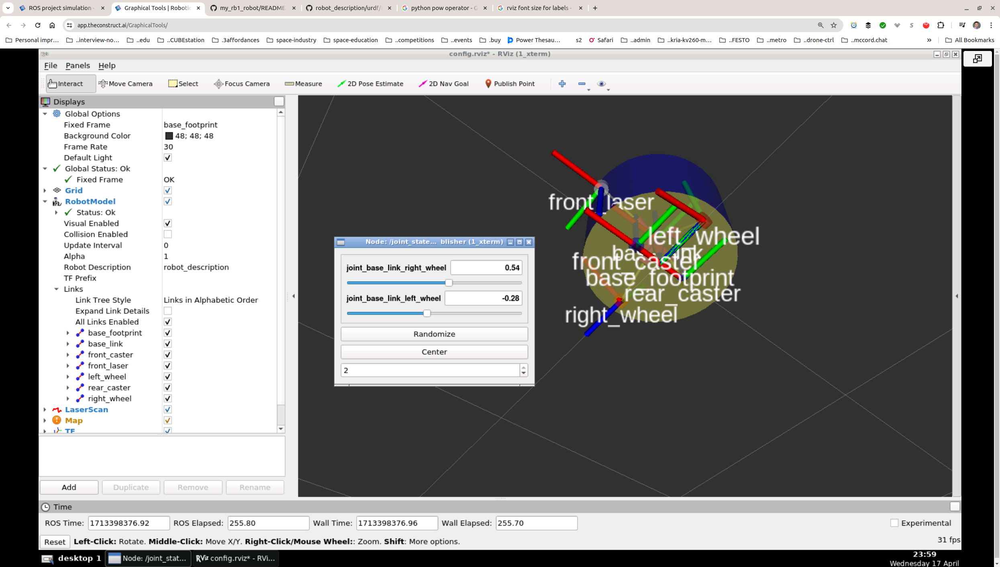
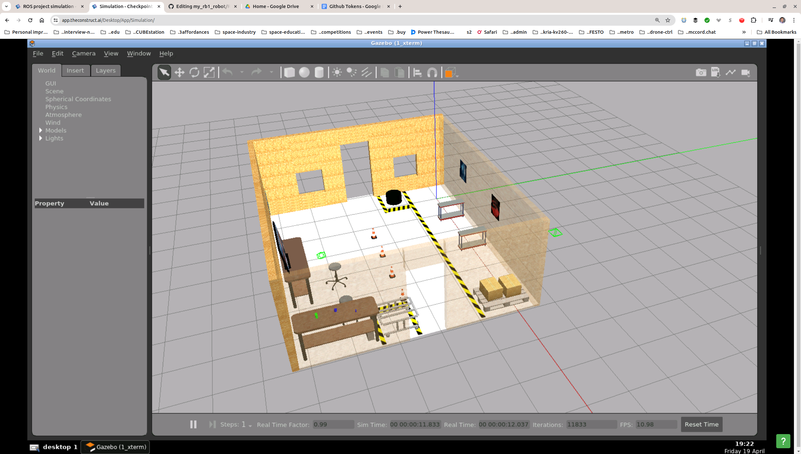

### my_rb1_robot

Repository for Checkpoint 1 of The Construct Robotics Masterclass. Creating a simple replica of the Robotnik RB-1 Base warehouse robot. The blueprint image below is copyright of Robotnik.



### Submission notes - Part 1

_Notes of interest to the reviewer!_

`roslaunch my_rb1_description display.launch`  

1. `base_footprint` is the root link and is default-positioned on the ground plane with parts on both sides of it. This will require spawning at `z=0.015` or slightly larger to avoid the anomaly of spawning a model under the ground plane.
2. The total mass of 25 kg has been split among the base, wheels, casters, and laser. Assuming solid shapes with equal density, the mass ratios are equal to their volume ratios.
3. The height/length of the wheel cylinders wasn't specified, so h = r = 0.025 was chosen.
4. `front_laser` is the same cylinder as the wheels.
5. The **Alpha** parameters in RViz were very slow to update, so all the links have an alpha of 0.5, for visibility.
6. The position of `base_link`, which is the child of a fixed joint with `base_footprint` was ambiguous. For example, what does it mean for a link to be "located at" something, in particular `base_link` being _"located at the center of the rotation axis that connect the two wheels"_? Looking at the dimensions, I interpreted it as the bottom plate of `base_link` coninsides with the imaginary axis between the two wheels.
7. I struggled long trying to figure out what the "link frame" was and what its properties and affordances were, but I think I finally understand, as you can see if you peruse my [Implementation notes](#implementation-notes). Finally, this resulted in what I think is a clean and minimal URDF definition of the robot.
8. For purposes of mass and inertia, I am treating the casters as a single solid sphere, without any nesting of two spheres, etc. It's so small, that these values are infinitesimal anyway. For the purposes of robot pose, I have "lifted" the outer sphere up along the `z` axis just as much as the inner nested sphere protrudes down from the outer sphere.

  

### Submission notes - Part 2

_Notes of interest to the reviewer!_

`roslaunch my_rb1_gazebo my_rb1_robot_warehouse.launch`  

1. The `z` argument for the launcher is meant to populate the robot "above ground" because the robot is centered at the origin of the root link `base_footprint` and the wheels "stick out" along the negative `z` axis.
   `    <arg name="z" default="0.0245"/> <!-- wheel radius 0.025 - half thickness of fooprint 0.0005 -->`
2. The publisher guis appear in separate windows.

  


### Implementation notes

_Private notes._

1. `tf` in ROS and RViz refers to **t**ransform between coordinate **f**rames. There is a world frame and each robot has at least one frame of its own and multiple if it has multiple components. The [`tf`](http://wiki.ros.org/tf) package (deprecated and superceded by [`tf2`](http://wiki.ros.org/tf2)) keeps track of and maintains the relation (i.e. transform) between the multiple frames in a world. The frames can be visualized in RViz as well as in a tree view. The [tutorial](http://wiki.ros.org/tf/Tutorials/Introduction%20to%20tf) illustrates this.
2. The moments of inertia are expressed as the terms of [3D inertia tensors](https://en.wikipedia.org/wiki/List_of_moments_of_inertia#List_of_3D_inertia_tensors). Note that the 3x3 inertia matrix is symmetric, so only 6 numbers are specified (see below). Instead of precomputing them, they can be expressed with their formulas and declared parameters. However, see note below on URDF and Xacro.
   ```xml
   <inertial>
        <mass value="10" />
        <origin
            xyz="0 0 0.3"
            rpy="0 0 0" />
        <inertia
            ixx="1.5417"
            ixy="0"
            ixz="0"
            iyy="3.467"
            iyz="0"
            izz="4.742" />
   </inertial>
   ```
3. The `inertial` tag has an origin. _What is this the origin of and how does it relate to the joint and link origins?_
4. For the purposes of inertia:
   1. The robot is a cylinder.
   2. The two wheels are cylinders.
   3. The caster wheels are (approximately) spheres. (In actuallity, a caster wheel is a sphere and an off-center nested sphere.)
   4. The scanner is a cylinder.
5. The project asks for a URDF file `my_rb1_robot.urdf` and not an Xacro file. Xacro allows definition of properies with `<xacro:property name="chassis_mas" value="10"/>` which can then be used in formulae in, for example `<mass value="${2 * chassis_mas}"/>`. In a way, XACRO serves as a _preprocessor_ for URDF, among other things. This means that all numbers have to be hardcoded (though their computation can be documented in comments) and `gazebo` tags should be in the one URDF file.
6. This is the first time that a "fooprint" links is used apart from the base link. It is usually a reference for the rest of the robot links and is defined to be co-planar with the ground plane. It helps with the simulation of a lot of robot behavior. `base_footprint` is a projection of `base_link` on the ground plane (floor) and there may be a parent-child dependence between the two. _What tags does the `base_footprint` have as a link since it is just a projection?_ _Is there a joint between `base_footprint` and `base_link` and, if yes, what type?_
7. A [link](https://wiki.ros.org/urdf/XML/link) has 4 reference frames associated with it (origin (in the joint), inertial, collision, visual) and specified in the corresponding `<origin />` tags.
8. On the "link frame":
   1. The most basic frame of the link (that is, the robot component defined in a `<link>` tag). It is _basic_ in the sense that all subtags, in particular the `<origin>` subtags, are _relative to it_.
   2. There doesn't seem to be a way to define the origin of the link frame itself. For a link called, say, `base_link`, that defines a simple shape, when "Fixed Frame" in RViz is set to `base_link`, the shape appears in the middle of the plane centered at the shape's center of mass (CoM). This would imply that the the link frame initially and by default (that is, when `xyz="0 0 0"` and `rpy="0 0 0") has its origin at the CoM of the link shape. What happens when the shape is more complex, it remains to be seen.
   3. Setting `xyz="1 1 1"` in `<visual>` and `<colision>`, for example, makes the shape appear at a distance of 1 along each of the 3 axes from its frame. What is the utility of that is not clear. For proper inertial calculations, it seem that if the shape is moved like this away from the origin of its frame, the `<inertial>` origin should be modified the same way.
   4. Since the link frame cannot be set explicitly, the way to place a link "above ground" (that is, its bottom is level with the ground plane) is to put half of its height in the `z` dimension of `<collision>` (none for footprint) and `<visual>`. Since `<inertial>-<origin>` is also relative to the link frame, it has to be corrected to again coincide with the link shape's CoM.
9. Cannot have two links that are not connected directly or indirectly, showing that there can be only one link in a URDF file.
10. The `<origin>` in `<joint>` places the link frame of the child relative to the link frame of the parent! The `<origin>` tags in the link `<inertial>`, `<collision>`, and `<visual>` tags are unnecessary if the link doesn't have to translate or rotate relative to its own frame (i.e. child link frame). If `base_footprint` is elevated above the ground, it's elevated relative to its own link frame, so that height + half of its thickness have to be added to the joint `<origin>` `z` dimension when placing the origin of the child link frame (for example, half a height of a cylinder).
11. The root link does not have to be in any way the most "downward". It can be a spatially "central" component, to which the rest of the components are attached through joints, in all directions. To spawn "above the ground" specify an argument for the vertical offset for the spawner. 
12. Probably the most confusing and nonsensical feature of URDF is that the shape can be offset from its frame of reference (the link frame). If that is done, all 3 subtags (inertial, collision, visual) have matching offsets. This becomes hard to track and get right for a complex robot. The more natural approach is to only specify the `<offset>` in joints, which moves the link frame for the child relative to the parent link frame. If the parent link frame is also defaulted, no parent offsets have to be added to the joint `<origin>`. Importantly, the `<inertial>-<origin>` of the child link may also be defaulted.
13. In a joint with an axis of rotation, the rotation is interpreted relative to the parent link frame!
14. Mass calulation:
    1. Total mass is 25 kg.
    2. 6 parts with non-zero mass:
       1. `base_link`, V = pi*h*r^2 = pi * 0.3*0.25^2 = pi * 0.01875
       2. `right_wheel`, V = pi * 0.025*0.025^2 = pi * 0.000015625 
       3. `left_wheel`, V = pi * 0.025*0.025^2 = pi * 0.000015625
       4. `front_caster`, V = pi * (4/3)*0.015^3 = pi * 0.0000045
       5. `rear_caster`, V = pi * (4/3)*0.015^3 =  pi * 0.0000045
       6. `front_laser` (casing), V = pi * 0.025*0.025^2 = pi * 0.000015625
       7. Total volume V_tot = pi * 0.018805875
    3. Assuming equal density.
       1. `base_link`, M = (25 / 1880.5875) * 1875 = 24.925721350375877 ~ 24.926
       2. `right_wheel`, M = (25 / 1880.5875) * 1.5625 = 0.020771434458646567 ~ 0.021
       3. `left_wheel`, M = (25 / 1880.5875) * 1.5625 = 0.020771434458646567 ~ 0.021
       4. `front_caster`, M = (25 / 1880.5875) * 0.45 = 0.005982173124090211 ~ 0.006
       5. `rear_caster`, M = (25 / 1880.5875) * 0.45 = 0.005982173124090211 ~ 0.006
       6. `front_laser` (casing), M = (25 / 1880.5875) * 1.5625 = 0.020771434458646567 ~ 0.021
15. Inertia calcualtion:
    1. Due to the 3-axis inertial tensor being a symmetric 2D matrix, the form of the form of the `<inertial>-<inertia>` subtag is as follows:
       `<inertia ixx="0" ixy="0" ixz="0" iyy="0" iyz="0" izz="0"/>`
    2. The following links are solid cylinders: `base_link`, `right_wheel`, `left_wheel`, `front_laser` (this is taken from the notebook).
    3. The inertial tensor for a solid cylinder is:
       1. Ixx = Iyy = (1/12) * m * (3 * r^2 + h^2)
       2. Izz = (1/2) * m * r^2
       3. Ixy = Ixz = Iyz = 0
    4. For `base_link`:
       1. m = 24.926, r = 0.25, h = 0.3
       2. Ixx = Iyy = (1/12) * 24.926 * (3 * 0.25**2 + 0.3**2) = 0.5764137499999998 ~ 0.5764
       3. Izz = (1/2) * 24.926 * 0.25**2 = 0.7789375 ~ 0.7789
       4. `<inertia ixx="0.5764" ixy="0" ixz="0" iyy="0.5764" iyz="0" izz="0.7789"/>`
    5. For `right_wheel`, `left_wheel`, and `front_laser`:
       1. m = 0.021, r = h = 0.025
       2. Ixx = Iyy = (1/12) * 0.021 * (3 * 0.025**2 + 0.025**2) = (1/3) * 0.021 * 0.025**2 = 4.375000000000001e-06 ~ 0.000004
       3. Izz = (1/2) * 0.021 * 0.025**2 = 6.562500000000002e-06 ~ 0.000007
       4. `<inertia ixx="0.000004" ixy="0" ixz="0" iyy="0.000004" iyz="0" izz="0.000007"/>`
    7. The following links are solid spheres: `front_caster` and `rear_caster`.
    8. The inertial tensor for a solid sphere is:
       1. Ixx = Iyy = Izz = (2/5) * m * r**2
       2. Ixy = Iyz = Ixz = 0
    9. For the caster, it is assumed that it is a single solid sphere and the internal/nested sphere is ignored.
    10. For `front_caster` and `rear_caster`:
        1. m = 0.006, r = 0.015
        2. Ixx = Iyy = Izz = (2/5) * 0.006 * 0.015**2 = 5.4e-07 ~ 0.0000005
        3. `<inertia ixx="0.0000005" ixy="0" ixz="0" iyy="0.0000005" iyz="0" izz="0.0000005"/>`
11. The parameter `robot_description` expected by RViz is defined in the launch file as follows:
    ```xml
    <launch>
        <param name="robot_description" command="cat '$(find my_rb1_description)/urdf/my_rb1_robot.urdf'"/>
        <!-- other inits and starts -->
    </launch>
    ```
16. Possible things **TODO** to fix the unwanted motion of the robot when spawned in the warehouse world and `preserveFixedJoint` and `mu`/`mu2` are specified in the URDF:
    1. ~Spawning "height". Is excessive height causing the robot to fall onto the ground, resulting in an impulse that causes the motion? But why wouldn't it move if they are not specified?~
       1. Doesn't seem to be affected in either direction, as if `z` is ignored.
    2. ~RB1 contact points with ground plane. Is the robot pose unstable a priori, for example, because the casters are not protruding from the bottom of the body exactly as much as the wheels?~
       1. Both the casters and the wheels "stick out" exactly the same distance of 0.025 m from the bottom of `base_link`. The casters do go "through" `base_footprint` but as it has no `inertial` and `collision` tags, it doesn't take part in the physics.
    3. Front caster z-direction wobbling. Might the `base_footprint` be messing things up? Or is it some artefact of `preserveFixedJoint`?
    4. R2D2 robot from scratch [tutorial](https://github.com/ros2/ros2_documentation/blob/rolling/source/Tutorials/Intermediate/URDF/Building-a-Visual-Robot-Model-with-URDF-from-Scratch.rst).
    5. Friction in Gazebo. Is there a decent enough explanation of how friction and collision are handled by default in Gazebo? Note that there are several libraries, one of which is [Bullet](https://www.google.com/search?q=bulletphysics&oq=bulletphy). The Open Dynamics Engine (ODE) is the default for Gazebo.
    6. Translation of URDF to SDF. Note where `mu` and `mu2` end up!!!
    7. Basic shapes and more complex models in Gazebo. Their definitions (if readable) should give a lot of clues as to what might be going wrong.
    8. ~Masses of RD1 links. What does the massless `base_footprint` do, being the root origin of the robot link tree? What if the most massive `base_link` is made the root, instead?~
       1. This [Gazebo wiki entry](https://answers.gazebosim.org//question/26449/fixed-joints-are-detaching-and-moving/) mentions dynamics problems with links with very small masses. _Might it make sense to make the wheels and casters heavier?_ **It seems like the changes below have more or less eliminated the unwanted motion though there is a rotational bias in translational commands.**
          1. New masses: wheel=0.5, caster=0.5, laser=0.5, base=25-2.5=22.5.
          2. New inertias:
             1. The following links are solid cylinders: `base_link`, `right_wheel`, `left_wheel`, `front_laser` (this is taken from the notebook).
             2. The inertial tensor for a solid cylinder is:
                1. Ixx = Iyy = (1/12) * m * (3 * r^2 + h^2)
                2. Izz = (1/2) * m * r^2
                3. Ixy = Ixz = Iyz = 0
             4. For `base_link`:
                1. m = 22.5, r = 0.25, h = 0.3
                2. Ixx = Iyy = (1/12) * 22.5 * (3 * 0.25**2 + 0.3**2) = 0.5203125
                3. Izz = (1/2) * 22.5 * 0.25**2 = 0.703125
                4. `<inertia ixx="0.5203125" ixy="0" ixz="0" iyy="0.5203125" iyz="0" izz="0.703125"/>`
             5. For `right_wheel`, `left_wheel`, and `front_laser`:
                1. m = 0.5, r = h = 0.025
                2. Ixx = Iyy = (1/12) * 0.5 * (3 * 0.025**2 + 0.025**2) = 0.00010416666666666669 ~ 0.0001042
                3. Izz = (1/2) * 0.5 * 0.025**2 = 0.00015625000000000003 ~ 0.0001563
                4. `<inertia ixx="0.0001042" ixy="0" ixz="0" iyy="0.0001042" iyz="0" izz="0.0001563"/>`
             6. The following links are solid spheres: `front_caster` and `rear_caster`.
             7. The inertial tensor for a solid sphere is:
                1. Ixx = Iyy = Izz = (2/5) * m * r**2
                2. Ixy = Iyz = Ixz = 0
             8. For the caster, it is assumed that it is a single solid sphere (support and wheel). The wheel protrudes from the support only slightly and there is a very small offset of the support and the wheel from the link frame origin (and, thus, the default CoM). Also, the support and wheel are defined via `collision` and `visual` under the same link.
             10. For `front_caster` and `rear_caster`:
                 1. m = 0.5, r = 0.015
                 2. Ixx = Iyy = Izz = (2/5) * 0.5 * 0.015**2 = 0.000045
                 3. `<inertia ixx="0.000045" ixy="0" ixz="0" iyy="0.000045" iyz="0" izz="0.000045"/>`
       2. There doesn't seem to be any reason to make `base_link` the root, and the simulator itself complains that the root link should not have inertia specified when there isn't a `base_footprint` and `base_link` is by defulat the root.
    9. ~Links with contact points (wheels, casters). No motion if fixed joints are lumped and there are no friction coefficients specified. What if the caster links remain lumped and the friction coefficients are specified only for the wheels? Can `/cmd_vel` motion be realized without specifying friction for the casters? What is the default friction, if not specified?~
       1. The robot cannot move with _lumped_ caster joints. The simulator probably defaults to infinite friction of the caster contact points with the ground and simply sending `/cmd_vel` commands doesn't move the robot.
       2. Once the caster joints are preserved with `<gazebo reference="joint_base_link_front_caster"><preserveFixedJoint>true</preserveFixedJoint></gazebo>`, the `/cmd_vel` works and the robot moves according to the command specified, though the unwnted motion is still there and at the very least changes the orientation of the robot.
       3. Adding `mu` and `mu2` values for the caster links doesn't change this behavior.
    10. ~The casters. Check the construction of the casters in the example solution. Should the two wheels be links in their own right instead of two `collision` + `visual` elements under the same link?~
        1. There is nothing special in the example, and the project has followed the general guidelines.
        2. There doesn't seem to be a good reason to separate the two "components".
    11. The wheels. What is the "first" direction of friction? Is it "along" the tangent of the spinning wheel at the point of contact with the ground plane? What is the "second"? Is it the orthogonal to the spinning wheel, specifying essentially that the wheels can rotate with little friction but cannot slide sideways (orthogonally to plane of rotation) due to much higher friction? If so, should `mu` be smaller and `mu2` much larger?
    12. Link tree. What strange dynamics can be caused by the _improper construction_ of the link tree? Some instability, some "hidden" jitter, etc.? What are the best practices?
17. In the [Differential Drive tutorial](https://classic.gazebosim.org/tutorials?tut=ros_gzplugins#DifferentialDrive), the example shows `base_footprint` as the default value for `robotBaseFrame`:
    `<robotBaseFrame>base_footprint</robotBaseFrame>`
18. Publishing to `/cmd_vel` causes the differential drive to move the robot in reverse. This seems to be a well-known problem but there doesn't seem to be a simple universal solution. Things tried:
    1. Rotating the `joint_base_footpring_base_link` 180 degrees => The base looks the other way.
    2. Rotating the `base_link` around its own frame => Doesn't change the direction.
    3. Preserving the fixed the `joint_base_footpring_base_link` => The robot isn't spawned.
    4. Reversing the sign of the command => Works fine, but not up to checkpoint requirement.

### References

1. [tf](http://wiki.ros.org/tf) package.
2. [tf2](http://wiki.ros.org/tf2) package.
3. [tf tutorial](http://wiki.ros.org/tf/Tutorials/Introduction%20to%20tf).
4. [Xacro](http://wiki.ros.org/xacro).
5. [`gazebo`](https://classic.gazebosim.org/tutorials?tut=ros_urdf) tag in URDF.
6. `base_footprint`:
   1. [What is the purpose of `base_footprint`?](https://answers.ros.org/question/208051/what-is-the-purpose-of-base_footprint/) on ROS Answers.
   2. [`base_link` to `base_footprint` transform?](https://answers.ros.org/question/12770/base_link-to-base_footprint-transform/) on ROS Answers.
   3. ROS [REP-120 # `base_footprint`](https://www.ros.org/reps/rep-0120.html#base-footprint) for a _humanoid_ robot.
7. [List of ROS enhancement proposals (REPs)](https://ros.org/reps/rep-0000.html). 
8. URDF [link](https://wiki.ros.org/urdf/XML/link).
9. URDF [joint](https://wiki.ros.org/urdf/XML/joint).
10. [Open Dynamics Engine (ODE)](https://ode.org/wiki/index.php?title=Manual) manual.
11. Gazebo [Physics Parameters](https://classic.gazebosim.org/tutorials?tut=physics_params&cat=physics) tutorial.
