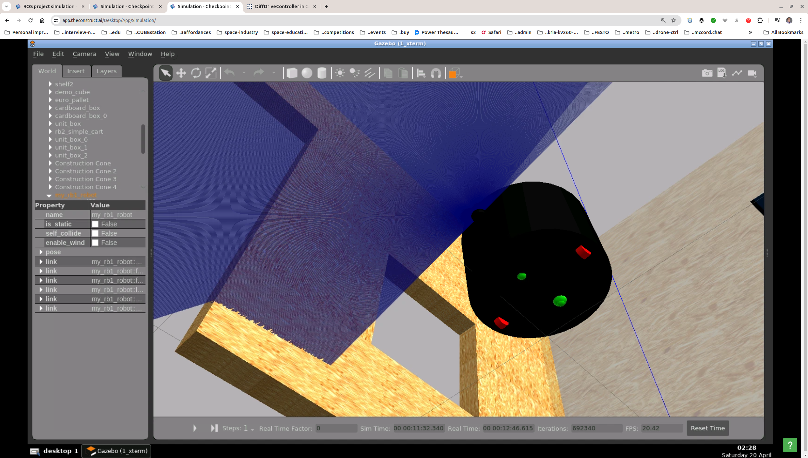

### Questions & Answers

Usually on the Discord server of The Construct (Server ID: 981943338167042158).

## _2024-04-10, 11:24_
I have the following questions on Checkpoint 1:
1. On `base_footprint`:
   1. The `base_footprint` is supposed to be sort of a "projection" of the robot on the ground plane, right? ("Sort of" because there can be a ton of details when the surface isn't the ground plane, etc., in which cases it is an imaginary shadow on the xy-plane in the robot's root link frame.)
   2. Is there a joint between `base_footprint` and `base_link`?
   3. If there is a joint, which of the two is the root and parent of the other?
   4. `base_footprint` has likely no `<inertial>` and `<collision>` tags but does it have `<visual>`, and if yes, how is a 2D shape specified or is it "very thin"?
   5. What is the child link's Lo frame or origin in this case. See next major point.
2. On origins, frames, and "locations" of links and joints:
   1. The joint frame and the child link's frame (or origin) is the `<origin>` specified in the joint, right? This is called L or Lo, right?
   2. The `<inertial>-<origin>` of a link is specified as the transform vector from Lo to Co, the center of mass (CoM) frame of the link. Correct?
   3. What is then the origin of the root link, the link for which there is no joint in which it is the child? A vector from the ground plane frame to the center of mass of the link? Then, is the `<origin xyz="0 0 0.3" rpy="0 0 0" />` for the `link_chassis` of the original robot to be interpreted that the root link's frame is 0.3 m above the ground plane? And what happens when we have a `base_footprint` as a root (if it is)?
   4. Under the Lo->Co interpretation of `<inertial>-<origin>`, does `"xyz = 0 0 0"` even make sense for a 3D object with non-zero dimensions? For this Checkpoint, the robot is composed of simple 3D shapes, for which the CoMs are well understood. For example, the CoM of a cylinder is half-way  along the axis between the centers of the flat planes on both "ends". But I haven't seen an entry for `<inertial>-<origin xyz="">` that has used the dimensions of the cylinder. As I conjectured, the Lo->Co vector cannot be zero for a 3D object.
   5. Are all the 3 `<origin>` subtags (all optional, btw) of the link tags `<inertial>`, `<collision>`, and `<visual>` relative to the link frame Lo, or are the second two relative to the first one (`<inertial>`)? See the next point for why I am asking.
3. On inertia:
   1. For the wheel links, we had `<inertial>-<origin xyz="0 0 0" />` but had nonzero `xyz` entry for the `<collision>` and `<visual>`. Isn't this incorrect? The center of mass of the axle and wheel system cannot possibly be at the origin of the joint. Or are we ingoring this subtlety until subsequent units?
   2. Are all the links except for `base_footprint` assumed to be **solid** or **hollow**? The interia coefficient are different in the two cases.
   3. Is the inertia for the caster wheel to be assumed to be the inertia of the outer sphere or should the outer and the partially nested inner be combined to compute it?
   4. Is the specified mass of 25 kg the _total_ mass of the robot or only the `base_link`? What are the masses for the other links? If they have no mass, they will have no inertia and `<inertial>` should be skipped, right?

## Answers to _2024-04-10, 11:24_

**Section 1. On base_footprint:**
Technically, the base_footprint must be at ground surface level, but having it at the base of the main body / chassis of the robot is also fine. You need to set this at z=0 level when you are strictly on a plane 2D surface, but practically that is not possible, so most people use the base of the robot chassis / body.
Yes, there is a joint between base_footprint and base_link.
The parent is usually base_footprint with immediate single child being base_link but the opposite can also be done in certain situations.
Yes, base_footprint does not usually have inertial or collision or even visual, but we add a infinitely small box or sphere to represent the point for visual debugging purposes purely and for nothing else.
This point is explained in section 2 below.
 
**Section 2. On origins, frames and locations of links and joints:**
L or Lo simply expands to Link and Link_origin. Joint origin is different from Link origin. They are not the same. The origin specified in a Joint is where the child_link is located. The origin specified in a Link defines how the link is positioned - link's xyz offset and rpy orientation.
Yes, inertial-origin is the Euclidean distance of the origin of the link from the link's center of mass / geometric center / barycenter / epicenter / centroid.
You can have only one root link in a URDF. If you choose that to be base_footprint then base_footprint is the root, otherwise it would be base_link. The origin is calculated automatically when you link base_link and base_footprint together. The origin z would be at 0.3/2 = 0.15 and not 0.3 since we are calculating from the centres and not object surfaces. Yes, we can have base_footprint as root, in most cases for a ground robot, it is the base_footprint.
The "Lo->Co" vector can be zeros xyz = 0 0 0. It is perfectly fine. It just means that Lo is same as Co.
The origin inside the link frame is relative to it's immediate parent.
 
**Section 3. On inertia:**
Yes, that could be wrong. The collision and visual should theoretically match the origin specified in the inertial. Otherwise it is either a design feature or a design flaw.
Yes, all links are assumed to be solid or hollow with its respective inertias. Since we do not have hollow basic shapes in gazebo, we are left only with solid shapes. We can however, make a 3D CAD model and use their respective inertias.
You would usually link the caster wheel to the outer sphere, so when you specify the respective individual inertias for each of the shapes, they get appropriately algebraically added up during simulation. You need not worry about inertia value exactness for small robots.
The 25 kg is the total mass of the robot including all of its components. You may appropriately choose a good proportion for sharing the total weight among the robot's components such as wheels, casters, laser, etc. Every link except the "ghost" root link has inertia and mass.

## _2024-04-16, 10:06_

On dimensions and pose:
1. ~How are the following two statements to be reconciled:~
   1. ~_Has 2 wheels of 5 cm diameter on each side of the base. One at (0.0, -0.2, -0.15) from the base_link and another at (0.0, 0.2, -0.15)._ and~
   2. ~_`base_link` located at the center of the rotation axis that connect the two wheels_~
2. ~Does a robot model need to be defined "above ground" in URDF for it to populate correctly in Gazebo?~

## Answers to _2024-04-16, 10:06_
1. The second statement is ambiguous, since "at" can mean just about anything. However, the dimensions and distances make the meaning clear:
   1. The robot's `base_link` is a cylinder 30 cm long (or tall, since it's not rotated on either the `x` or `y` axis).
   2. The wheels, which are rotated around the `x` axis, are at z=-0.15. so the axis (of rotation) intersecting their centers is exactly at the "bottom" of the cylinder. This explains the meaning of the second statement.
2. It seems like it doesn't have to:
   1. If the robot is defined to be above and below the imaginary ground plane intersecting the origin of the root link frame, to spawn above the ground, specify `-z Z` in the argumants to the spawner where `Z` is the height of the robot frame origin (the origin of the root link frame) above the plane. (See [Gazebo Answers](https://answers.gazebosim.org//question/24436/how-to-specify-urdf-link-which-attaches-to-world-ground/))
   2. To avoid sinking, define the collision parameters for all links. _Define inertia for the rest of the physics._ (See [Gazebo Answsers](https://answers.gazebosim.org//question/24436/how-to-specify-urdf-link-which-attaches-to-world-ground/))

## _2024-04-19, 20:29_

What causes a non-zero motion of the robot when populated and not given any commands? Details:
1. The robot moves in what appears to be a tight circle.
2. It does not respond to a "stop" command (that is, all zeros) on `/cmd_vel`.
3. The `front_caster` link seems to be wobbling in the `z` direction, so the motion of the robot might be caused by gravity and a "sinking" caster. The robot appears to be tilted forward and might be rotating around the sinking caster.
4. When the physics are turned off by `rosservice call /gazebo/pause_physics`, the robot stops rotating.
5. Commenting out the differential drive doesn't stop the robot rotation!
6. Reverting to tag `task2`, the robot doesn't move. It's static in its initial position. After restoring to `main-HEAD`, the motion is now a translation along the `x` axis, and the caster is not "wobbling". I did remove the `preserveFixedJoint` tags. It's becoming rather complicated. Next thing is to hunt down the change from `task2` on.
7. The culprits may be the friction coefficients `mu` and `mu2`. I had added them when I added the differential drive and the `preserveFixedJoint`, zeros for casters and ones for wheels. I just commented them out (note that diff drive, scanner, and `preserveFixedJoint` are also commented out) and the motion stopped. This is nice, but I don't understand it. Yet, anyway.
   
     
